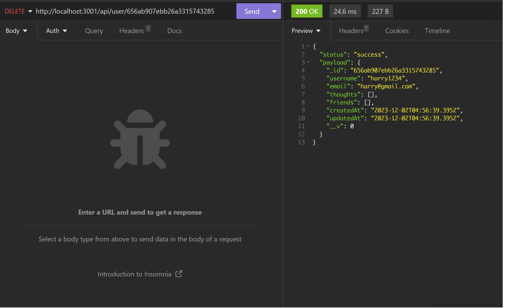
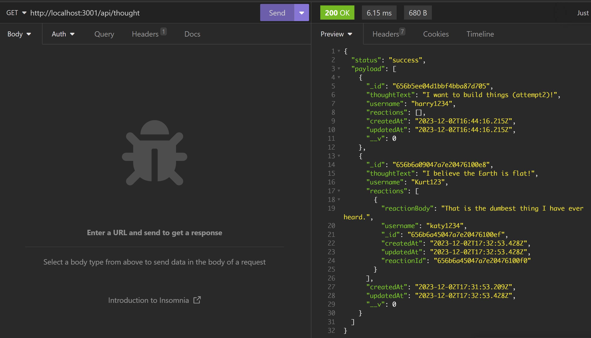

# Social Network API

## Run Command

```md
npm run dev
```
- Automatically syncs Mongoose models to MongoDB

## API Routes for Users and Thoughts

- GET - all
- GET - single
- POST - create/add new one
- PUT - update any part 
- DELETE - delete one


## API Routes for Friends and Reactions

- POST - create/add new one
- DELETE - delete one


## Previews






## Walk Through Video

- https://drive.google.com/file/d/1rpQzmL9HbfkDWsjwwclNxG49WOh6s4Nm/view